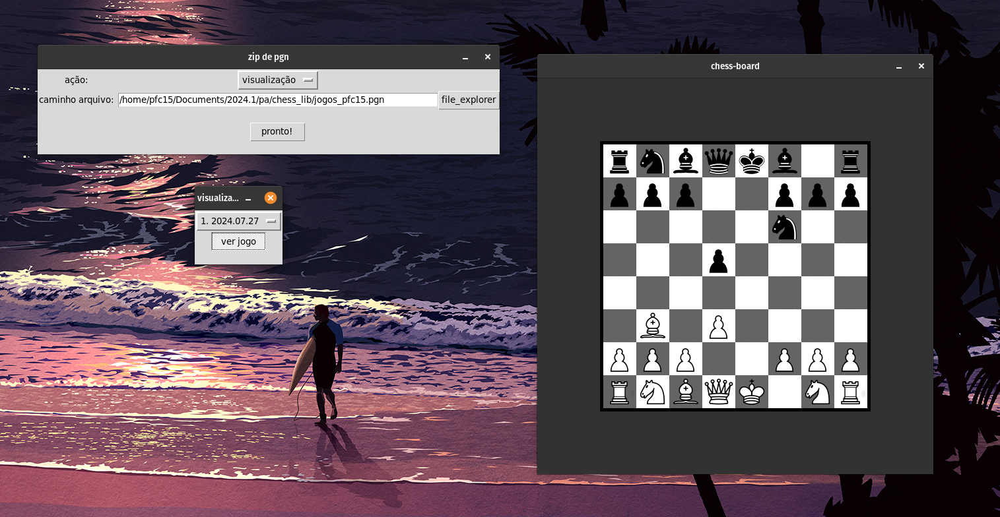
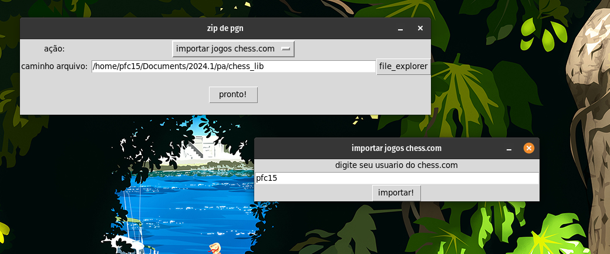
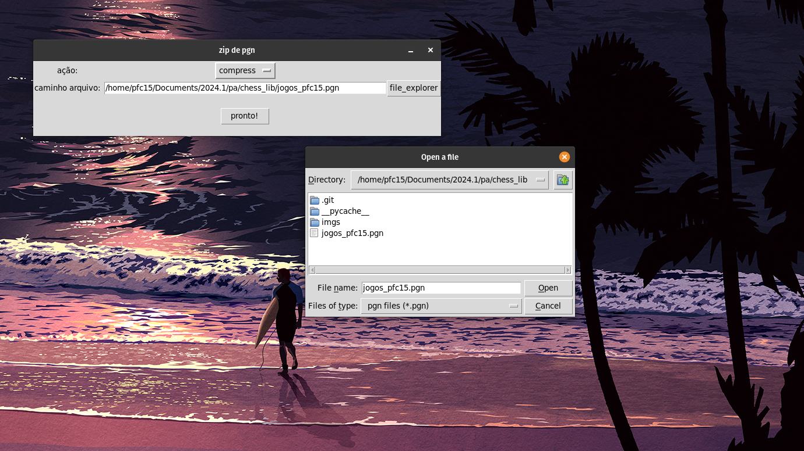

# Lista de Exercícios do LeetCode

**Número da Lista**: <br>
**Conteúdo da Disciplina**: greed<br>

## Alunos
|Matrícula | Aluno |
| -- | -- |
| 21/2005444  |  Pedro Fonseca Cruz |

## Sobre 
Foi desenvolvido um compressor de arquivor .pgn. O tipo .pgn é um tipo de arquivo para guardar jogos de xadrez. Foi implementado um compressor e decompressor (baseado no algorítimo de Hoffman) um importador de jogos do chess.com, o maior site de xadrez online do mundo. E um visualizador de jogos vindos de arquivos .pgn.  

## Screenshots
- visualização de jogos em arquivos .pgn


- dando import dos jogos do chess.com


- selecionando o arquivo para a zipagem do arquivo


## Instalação 
**Linguagem**: Python<br>
**Pré-requisitos**: python e pip instalados
<br>

## 1. Clone o repositório

```bash
git clone https://github.com/pfc15/PGN_Chess_compress
```

### 2. Compile o programa


rodar no terminal:

```bash
pip install -r requisitos.txt
```

### 2. Compile o programa
para linux:
```bash
python3 gui.py
```

para windows:
```bash
py gui.py
```

## Uso 
rodar o arquivo gui.py pelo terminal com python e então navegar pela interface gráfica.

## Apresentação 

A apresentação da entrega pode ser visualizada [aqui](https://www.youtube.com/watch?v=DzwIaUZssiU). 